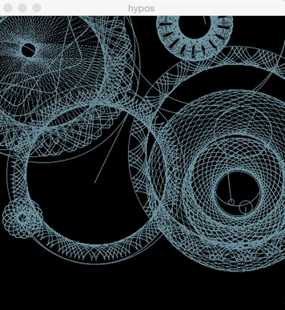

## El Código Como Arte

Hoy en día nuestras vidas están mediadas por código informático: en el teléfono, en la computador o en cualquier otra pantalla con la interactuamos, es por eso  que diferentes colectivos y grupos de estudio se han puesto a indagar sobre el potencial de código en la creación de contenido visual, multimedia e interactivo.
Estas personas han logrado convertir el código informático en una paleta multicolor y la pantalla en el lienzo dónde han plasmados sus expresiones artísticas.

## El Arte Como Código

Este nueva forma de ver el código informático ha impactado de tal manera que hoy en día contamos con VJs, artistas del MAPING e ilustradores digitales, logrando expandir la definición del arte hasta el mundo digital, es cierto que no todos los artistas digitales trabajan con código informático, pero los artistas que utilizan estas técnicas se destacan por crear obras que difícilmente pueden imaginarse en la mente humana.

## P5js Atelier

Es un nuevo espacio de experimentación que Bakata Hacklab y Libre Colaboración abren para que los asistentes puedan dar sus primeras pinceladas digitales y así experimentar la creación de contenidos multimedia desde la programación.
