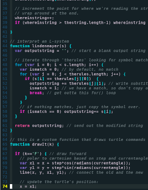

## El Código Como Arte

Hoy en día nuestras vidas están mediadas por código informático: en el teléfono, en la computador o en cualquier otra pantalla con las que interactuamos, es por eso que diferentes colectivos y grupos de estudio se han puesto a indagar sobre el potencial de código en la creación de contenido visual, multimedia e interactivo.
Estas personas han logrado convertir el código informático en una paleta multicolor y la pantalla en el lienzo dónde han plasmados sus expresiones artísticas.

## El Arte Como Código

Este nueva forma de ver el código informático ha impactado de tal manera que hoy en día contamos con VJs, artistas del MAPING e ilustradores digitales y más recientemente el live coding, logrando expandir la definición del arte hasta el mundo digital, es cierto que no todos los artistas digitales trabajan con código informático, pero los artistas que utilizan estas técnicas se destacan por crear obras que difícilmente pueden imaginarse en la mente humana.

## P5js Atelier

Es un nuevo espacio de experimentación que Carlos Rocha desea abrir para que los asistentes puedan dar sus primeras pinceladas digitales y así experimentar la creación de contenidos multimedia desde la programación. Este atelier contará con cuatro sesiones de tres horas cada uno, donde los asistentes podrán exprimentar de forma practica la generación de gráficos por computador.

### ¿A quién va dirigido?

Este atelier va dirigido para personas que tenga alguna de las siguientes habilidades o perfiles: 

* [x] Conocimientos básicos en programación.
* [x] Conocimientos básicos en edición de audio o video.
* [x] Artistas audiovisuales.
* [x] Usuarios de software libre o aficionados a la tecnología.
* [x] Estudiantes de artes digitales, plasticas o afines.

### ¿Qué se necesita pra dictarlo?

Salon con computadors y un video beam el cual este disponible los días sabados entre 3 a 6 de la tarde.

### ¡quién lo dictaría?

El taller estaría a cargo de Carlos Rocha, quien es un entusiasta de las tecnologías libres y la cultura libre, en el 2018 dedico gran parte de su tiempo en el estudio empirico de la interacción entre código y arte, lleva a cabo formaciones en Plataforma Bogotá como: "Live coding los patrones de la música" y "(A)sincronia audivisual"

### Cronograma

Sesión | Tema
------ | -----
9 de febrero | Primeras figuras geometricas y modificación de sus caracteristicas. 
16 de febrero | Animaciones básicas.
23 de febrero | Ejecución de ciclos.
2 de marzo | Uso básico de imagenes y audios.

### Datos del Atelier

* **Lugar:** Por convenir
* **Valor:** No tiene
* **Cupos:** 15 personas
* **Fecha:** Del 9 de febrero al 2 de marzo del 2019
* **Hora:** de 3 a 6 pm (sujeto a modificaciones, podría ser desde las dos dependiendo lo convenido con el sitio)
* **Inscripciones:** Por convenir

----------------------//-------------------------

 
